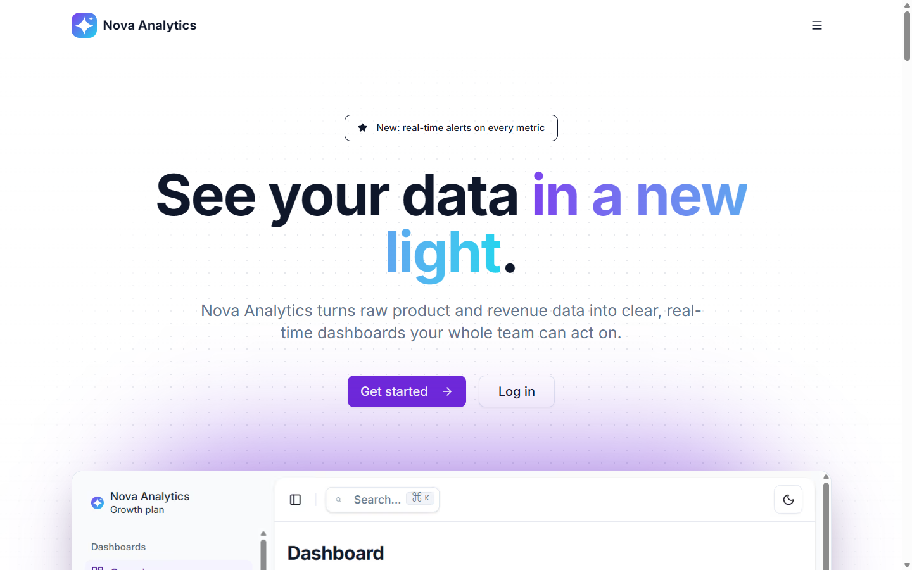
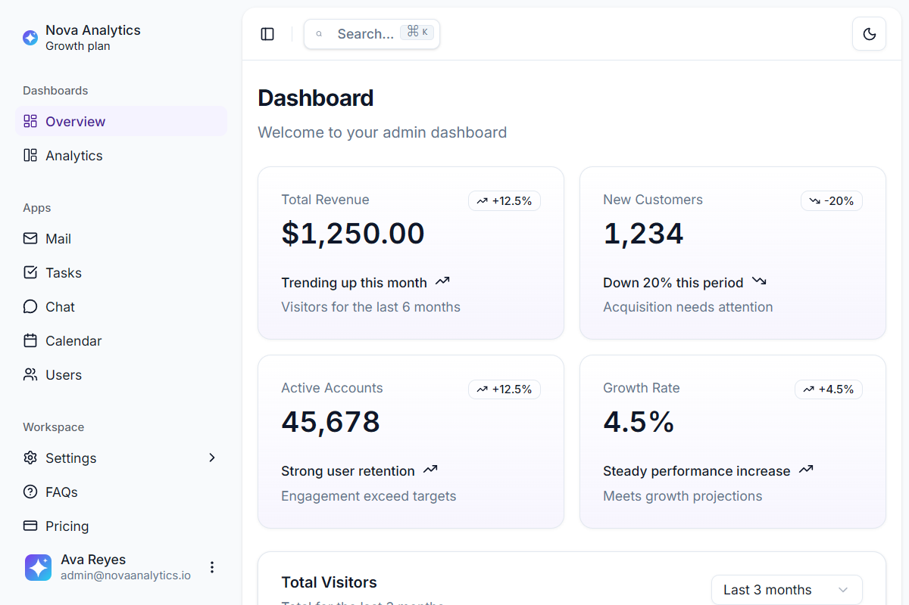

# Nova Analytics Dashboard

> See your data in a new light. Nova Analytics turns raw product and revenue data into clear, real-time dashboards your whole team can act on.

**Live demo:** https://nova-analytics-khaki.vercel.app · **Test login:** `admin@novaanalytics.io` / password provided in SUBMISSION notes




---

## Overview

Nova Analytics is a whitelabeled data-dashboard product built for a fictional client as part of a technical trial. It provides a public marketing landing page, real email/password authentication, and a protected analytics dashboard.

This project is a rebrand of an open-source dashboard template (see [Credits](#credits)), extended with production authentication and deployed to a live HTTPS environment. The whole build was driven with **Claude Code** — see [`PROMPTS.md`](PROMPTS.md) for the process.

## Tech stack

| Layer | Technology |
|---|---|
| Framework | Next.js 16 (App Router, React 19, Turbopack) |
| Language | TypeScript |
| UI | shadcn/ui + Radix UI |
| Styling | Tailwind CSS v4 (brand tokens as CSS variables in `src/app/globals.css`) |
| Auth | Supabase (email/password via `@supabase/ssr`) |
| Charts / tables | Recharts 3, TanStack Table |
| Hosting | Vercel (automatic HTTPS) |
| CI | GitHub Actions (lint + build on every push/PR) |

## Features

- **Marketing landing page** at `/` — responsive hero, features, pricing, testimonials, FAQ, and CTAs to sign up / log in.
- **Authentication** — real signup, login, logout, and password reset backed by Supabase; sessions refreshed on every request by `src/proxy.ts`.
- **Protected dashboard** — unauthenticated visitors to `/dashboard` (or any app page) are redirected to `/sign-in`; successful auth lands on `/dashboard`. The proxy fails closed if Supabase env vars are missing.
- **Whitelabeled UI** — Nova Analytics branding, violet/aqua palette, logo, and favicon throughout; dark mode included. Chart colors are validated for color-blind-safe separation and contrast in both modes.

## Getting started

### Prerequisites
- Node.js 18+ (Node 22 recommended)
- pnpm (`npm install -g pnpm`)
- A free [Supabase](https://supabase.com) project

### 1. Install
```bash
git clone https://github.com/Jmira323/shadcn-dashboard-landing-template.git
cd shadcn-dashboard-landing-template
pnpm install
```

### 2. Environment variables
Copy the example file and fill in your Supabase credentials (Supabase dashboard → Settings → API):
```bash
cp .env.example .env.local
```
```dotenv
NEXT_PUBLIC_SUPABASE_URL=https://<your-project>.supabase.co
NEXT_PUBLIC_SUPABASE_ANON_KEY=<your-anon-public-key>
```

### 3. Run
```bash
pnpm dev        # http://localhost:3000
```

### 4. Create a test user
In the Supabase dashboard → **Authentication → Users → Add user**, create `admin@novaanalytics.io` with a password. (For quick demos you can disable email confirmation under Authentication → Sign In / Providers → Email.)

## Deployment (Vercel)

1. Push your fork to GitHub (public).
2. In Vercel: **New Project → Import** the repo → framework preset **Next.js** → root directory = repo root.
3. Add the two environment variables above in Vercel's project settings.
4. Deploy. Then set your production URL as the **Site URL** and add it to **Redirect URLs** in Supabase → Authentication → URL Configuration so auth works on the live domain.

## Project structure (high level)
```
src/
  app/
    page.tsx          # landing page (public)
    landing/          # landing sections (hero, features, pricing, FAQ, ...)
    (auth)/           # /sign-in, /sign-up, /forgot-password, /errors
    (dashboard)/      # protected app: dashboards, mail, tasks, chat, users, settings
  components/         # shared UI (shadcn/ui), sidebar, header, logo
  lib/supabase/       # browser + server Supabase clients
  proxy.ts            # session refresh + route protection (Next 16 middleware)
public/               # brand SVGs, favicon assets, app screenshots
.github/workflows/    # CI: lint + build
```

## Known limitations / what I'd improve with more time

- Auth is email/password only; I would add OAuth (Google/GitHub) and an in-app password-change flow.
- Dashboard data is sample/mock data; I would connect real data sources or Supabase tables per workspace.
- I would add role-based access and per-workspace data isolation.
- No automated E2E tests yet; I would add Playwright coverage for the auth happy paths and wire it into CI.

## Credits

Built on the MIT-licensed [shadcnstore/shadcn-dashboard-landing-template](https://github.com/shadcnstore/shadcn-dashboard-landing-template). All original branding has been replaced with the fictional Nova Analytics identity as part of the whitelabel exercise. Original template © ShadcnStore under the MIT License (retained in [`License.md`](License.md)).

## License

MIT — see [`License.md`](License.md).
